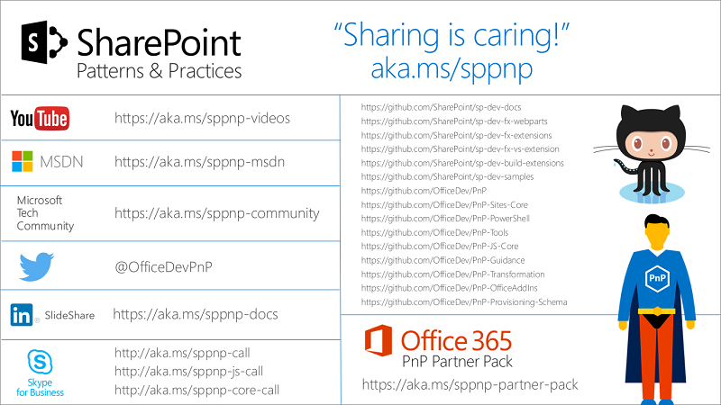

# Patterns and Practices (PnP)
 PnP is an open source initiative coordinated by SharePoint engineering to share documentation, guidance, samples and reusable component for the community.

## Concepts to Learn
Feel free to mark as completed `- [x] Concept name` every concept you've already fully understand. To learn a new concept go to the resources section and read/practice about it. As soon as you have fully understood all the concepts on this chapter go to the next chapter.

| Repository | Description |
| --- | --- |
| [PnP](https://github.com/OfficeDev/PnP) | Main repository for SP add-ins |
| [PnP-Guidance](https://github.com/OfficeDev/PnP-Guidance) | Repository for guidance articles and materials |
| [PnP-Sites-Core](https://github.com/OfficeDev/PnP-Sites-Core) | Repository for PnP Core component |
| [PnP-JS-Core](https://github.com/OfficeDev/PnP-JS-Core/) | Repository for PnP JavaScript Core component |
| [PnP-PowerShell](https://github.com/OfficeDev/PnP-PowerShell) | Repository for PnP PowerShell Cmdlet's |
| [PnP-Provisioning-Schema](https://github.com/OfficeDev/PnP-provisioning-schema/) | Repository for remote provisioning schema design |
| [PnP-Transformation](https://github.com/OfficeDev/PnP-Transformation) | Repository for Transformation tooling |
| [PnP-Tools](https://github.com/OfficeDev/PnP-Tools) | Scripts and tools for SharePoint on-premises and Office 365 |
| [PnP Partner Pack](https://github.com/SharePoint/PnP-Partner-Pack) | Reusable starter kit for typical enterprise requirements |

## Resources

### Tutorials
  * [PnP Shorts - Guidance Videos](https://www.youtube.com/playlist?list=PLR9nK3mnD-OXZbEvTEPxzIOMGXj_aZKJG)
  * [Office 365 development and SharePoint patterns and practices solution guidance](https://msdn.microsoft.com/en-us/pnp_articles/office-365-development-patterns-and-practices-solution-guidance)

### Excercises
  * [PnP code samples](https://dev.office.com/code-samples#?filters=Guidance)

### References
  * [Patterns and Practices MS dev center](https://dev.office.com/patterns-and-practices)
  * [PnP on GitHub](https://github.com/SharePoint/PnP)

## Next chapter
  * [SPFx](../SPFx)